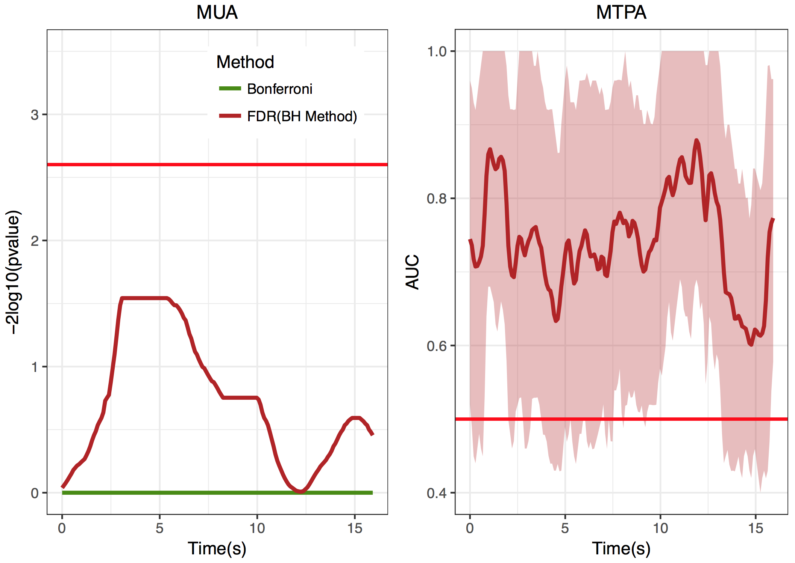

```{r, echo = FALSE}
knitr::opts_chunk$set(collapse=TRUE, 
                      comment="##", 
                      fig.retina=2, 
                      fig.path = "README_figs/README-")
```
<!-- README.md is generated from README.Rmd. Please edit that file -->
[](https://opensource.org/licenses/MIT)


# Multi-Time Points Analysis
In the data analysis of functional near-infrared spectroscopy (fNIRS), linear model frameworks, especially the mass univariate analysis (MUA), are often performed when researchers consider examining the difference between conditions at each sampled time point. 

However, some statistical issues, such as assumptions of linearity, auto-correlation and multiple comparison problems, influence the statistical inferences when using the MUA on fNIRS time course data. 

Therefore, we proposed a novel perspective, **Multi-Time Points Analysis (MTPA)**, to discriminate signal differences between conditions by combining temporal information from multiple time points in fNIRS.

The MTPA adopted the random forest algorithm from statistical learning domain, followed by a series of cross validation procedures, providing reasonable power for detecting significant time points and ensuring the generalizability. 

Using an real fNIRS dataset, the proposed MTPA would outperform the MUA. As we seen in the following figure, the MUA with either false discovery rate correction or bonferroni correction could not detect any significant time points. Even we applied two non-parametric permutation frameworks, including the maximum *t*-statistics and the 1-D temporal clustering methods, the MUA still could not show any finding. In contrast, the proposed MTPA can successfully detect more time points showing significant differences between experimental conditions.

Furthermore, the MTPA could also easily make a comparison between different areas, leading to a novel viewpoint of fNIRS time course analysis and providing additional theoretical implications in future fNIRS studies.

The present repository contains (1) an real fNIRS dataset as an example, (2) the code that demonstrated how to use MTPA in the basic `R` environment, (3) the code of doing the MUA for comparison, and (4) the code to generate figures.

Have fun with **MTPA** !



## Structure of the Repository

- **`Code`**: The code that were used to perform the MTPA and the mass univariate analysis are provided in this folder.
    - **FiguresCode.R**: The code to generate figures
    - **MTPA.R**: The code to perform the MTPA
    - **MTPA_B3.R**: The code to perform the MTPA with a different bandwidth value (bandwidth value = 3)
    - **MTPA_BandwidthComparison.R**: The code to compare the results of MTPA for two bandwidth values (2 & 3)
    -	**MUA_padjust.R**: The code to perform the mass univariate analysis with 3 types of p-value corrections
    -	**MUA_pt_ms.R**: The code to perform the mass univariate analysis with maximum *t*-statistics in the non-parametric permutation framework
    -	**MUA_pt_1dtc.R**: The code to the mass univariate analysis with 1-D temporal clustering in the non-parametric permutation framework
    -	**MUA_GLM.R**: The code to perform the mass univariate analysis in a general linear model (GLM) framework
-	**`Data`**: The fNIRS dataset that was used in the present study are available in this folder.
    -	**NIRSdata_LTFGLMTG.csv**: The dataset in CSV format
    -	**NIRSdata_LTFGLMTG.Rdata**: The dataset in Rdata format for R users to quickly assess the data
-	**`Figures`**: The figures (pdf/tiff) generated by the code (**FiguresCode.R**) are provided in this folder.
-	**`Functions`**: Some additional supporting functions to generate the figures are provided. When users run **FiguresCode.R**, these supporting functions will be loaded.
-	**`Results`**: Some results that were produced by the MTPA and the mass univariate analysis are provided. When users run **FiguresCode.R**, these results will be loaded to support plotting.


## Dependencies

- [`boot`](https://cran.r-project.org/web/packages/boot/boot.pdf) (Canty and Ripley, 2017)
- [`crayon`](https://cran.r-project.org/web/packages/crayon/index.html) (Csárdi and Gaslam, 2017)
- [`devtools`](https://cran.r-project.org/web/packages/devtools/index.html) (Wickham, et al. 2018)
- [`ERP`](https://cran.r-project.org/web/packages/ERP/index.html) (Sheu, Perthame, Lee and Causeur, 2016)
- [`fdrtool`](https://cran.r-project.org/web/packages/fdrtool/index.html) (Klaus and Strimmer, 2015)
- [`gridExtra`](https://cran.r-project.org/web/packages/gridExtra/index.html) (Auguie, 2017)
- [`ggthemes`](https://cran.r-project.org/web/packages/ggthemes/index.html) (Arnold, et al. 2018)
- [`leaps`](https://cran.r-project.org/web/packages/leaps/leaps.pdf) (Lumley, 2017)
- [`mnormt`](https://cran.r-project.org/web/packages/mnormt/index.html) (Azzalini, 2016)
- [`pROC`](https://cran.r-project.org/web/packages/pROC/pROC.pdf) (Robin, et al., 2018)
- [`reshape2`](https://cran.r-project.org/web/packages/reshape2/reshape2.pdf) (Wickham, 2014)
- [`randomForest`](https://cran.r-project.org/web/packages/randomForest/randomForest.pdf) (Breiman, 2001)
- [`tidyverse`](https://cran.r-project.org/web/packages/tidyverse/index.html) (Wickham, 2017)

## References

- Benjamini, Y., & Hochberg, Y. (1995). Controlling the false discovery rate: a practical and powerful approach to multiple testing. Journal of the royal statistical society. Series B (Methodological), 289-300.
- Benjamini, Y., & Yekutieli, D. (2001). The control of the false discovery rate in multiple testing under dependency. Annals of statistics, 1165-1188.
- Chen, H.-C., Vaid, J., Boas, D. A., & Bortfeld, H. (2011). Examining the phonological neighborhood density effect using near infrared spectroscopy. Human Brain Mapping,
32(9), 1363-1370.
- Chen, H.-C., Vaid, J., Bortfeld, H., & Boas, D. A. (2008). Optical imaging of phonological
processing in two distinct orthographies. Experimental brain research, 184(3),
427-433.
- Chou, T.-L., Chen, C.-W., Fan, L.-Y., Chen, S.-Y., & Booth, J. R. (2009). Testing for a cultural influence on reading for meaning in the developing brain: The neural basis of
semantic processing in Chinese children. The developing human brain, 195.
- Chou, T.-L., Chen, C.-W., Wu, M.-Y., & Booth, J. R. (2009). The role of inferior frontal gyrus and inferior parietal lobule in semantic processing of Chinese characters.
Experimental brain research, 198(4), 465-475.
- Friedman, J., Hastie, T., & Tibshirani, R. (2001). The elements of statistical learning (Vol. 1):Springer series in statistics Springer, Berlin.
- Haxby, J. V., Connolly, A. C., & Guntupalli, J. S. (2014). Decoding neural representational spaces using multivariate pattern analysis. Annual review of neuroscience, 37,
435-456.
- Haynes, J.-D. (2015). A primer on pattern-based approaches to fMRI: principles, pitfalls, and
perspectives. Neuron, 87(2), 257-270.
- James, G., Witten, D., & Hastie, T. (2014). An Introduction to Statistical Learning: With Applications in R.
- Nichols, T., & Hayasaka, S. (2003). Controlling the familywise error rate in functional neuroimaging: a comparative review. Statistical methods in medical research, 12(5), 419-446.
- Poline, J. B., & Mazoyer, B. M. (1993). Analysis of individual positron emission tomography activation maps by detection of high signal-to-noise-ratio pixel clusters. Journal of Cerebral Blood Flow & Metabolism, 13(3), 425-437.
- Poline, J. B., Worsley, K. J., Evans, A. C., & Friston, K. J. (1997). Combining spatial extent and peak intensity to test for activations in functional imaging. Neuroimage, 5(2), 83-96.
- Yu, C.-L., Wang, M.-Y., & Hu, J.-F. (2016). Valence processing of first impressions in the
dorsomedial prefrontal cortex: a near-infrared spectroscopy study. Neuroreport, 27(8), 574.

## Authors

[Chi-Lin Yu](https://github.com/PsyChiLin) : Department of Psychology, National Taiwan University, Taiwan<br />
[Hsin-Chin Chen](https://sites.google.com/site/hsinchinchenx/): Department of Psychology, National Chung Cheng University, Taiwan<br />
[Zih-Yun Yang](https://sites.google.com/site/lcnlccu/people/graduate-students): Department of Psychology, National Chung Cheng University, Taiwan<br />
[Tai-Li Chou](http://www.psy.ntu.edu.tw/index.php/members/faculty/fulltime-faculty/314-chou-tai-li) : Department of Psychology, National Taiwan University, Taiwan<br />

If you have a question, comment, concern or code contribution about MTPA, please send us an email at psychilinyu@gmail.com.